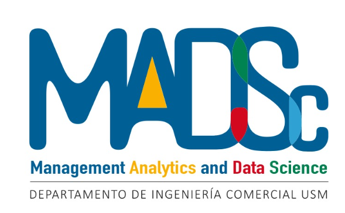

---
hide:
  - navigation
  - toc
---

# Bienvenidos a MADSc

El centro tiene como objetivo principal
impulsar investigaciones que empleen herramientas
de ciencia de datos en el ámbito de la economía y
los negocios.  Este propósito se orienta tanto hacia
objetivos académicos puros como hacia la resolución 
de problemáticas específicas que afectan a la industria.

Para lograrlo, el centro reúne a expertos en ciencia
de datos procedentes tanto del ámbito académico
como del industrial. La participación activa de 
académicos de la USM y otras universidades de Chile
y del extranjero fortalece la diversidad
de perspectivas y enfoques en las investigaciones.

El centro destaca por su estrecha relación
con la industria, evidenciada a través de 
alianzas estratégicas como la colaboración
con la empresa Tinet. Además, cuenta con 
una red extensa de colaboradores que incluye
expertos en ciencia de datos provenientes de
reconocidas empresas.

Esta conexión directa 
con el sector empresarial garantiza que las 
investigaciones no solo sean relevantes desde
el punto de vista académico, sino que también
proporcionen soluciones prácticas a los desafíos
enfrentados por la industria en el campo de la
economía y los negocios.